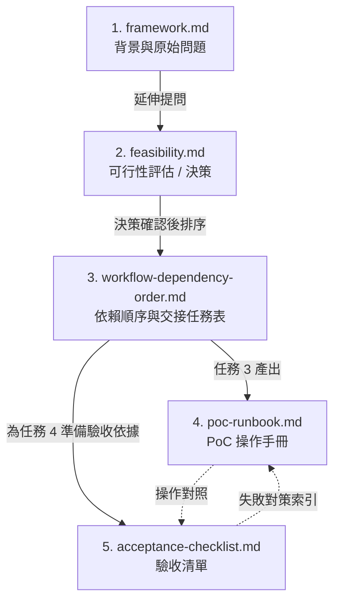

# `docs/` 文檔索引

本目錄記錄「以藍色 Visual Studio Code 取代紫色 Visual Studio 開發 SharePoint Server / `.NET Framework` 專案」這個假設的決策、流程、操作與驗收，按生命週期分成 5 份主文件，並另附 1 份元件參考文件。

## 文件總覽

| # | 文件 | 角色定位 | 回答的問題 | 主要讀者 |
|---|------|----------|------------|----------|
| 1 | [`framework.md`](./framework.md) | **背景與需求** | 為什麼想避開紫色 Visual Studio？最初要解什麼問題？ | 任何人（最早閱讀） |
| 2 | [`vscode-sharepoint-dotnet-framework-feasibility.md`](./vscode-sharepoint-dotnet-framework-feasibility.md) | **可行性評估**（決策） | 這個假設成立嗎？技術路線應該怎麼走？哪些不該承諾？ | 決策者、架構評估者 |
| 3 | [`vscode-sharepoint-workflow-dependency-order.md`](./vscode-sharepoint-workflow-dependency-order.md) | **工作流依賴順序與交接任務表** | 從決策到實測的順序是什麼？目前進度卡在哪？下一步是誰做什麼？ | 開發者、PM、接手者 |
| 4 | [`vscode-sharepoint-poc-runbook.md`](./vscode-sharepoint-poc-runbook.md) | **公司電腦 PoC 操作手冊**（教 **怎麼操作**） | 公司電腦怎麼準備環境？第一次 build/package/deploy 怎麼跑？失敗怎麼排查？ | 在公司電腦執行 PoC 的工程師 |
| 5 | [`vscode-sharepoint-acceptance-checklist.md`](./vscode-sharepoint-acceptance-checklist.md) | **使用者驗收清單**（驗 **能不能取代 VS**） | VS Code 真的能取代 Visual Studio 嗎？6 個 Stage 是否全數通過？ | 驗收人、QA、第二驗收人 |
| 附 | [`omnisharp-server-reference.md`](./omnisharp-server-reference.md) | **OmniSharp Server 元件參考** | OmniSharp 是什麼？為什麼要用 legacy mode？壞掉時要從哪裡看？ | 排查 IntelliSense 問題者、想理解設定原理者 |

## 閱讀建議

依照你的角色，可以採用以下入口：

| 你是… | 建議閱讀順序 |
|-------|--------------|
| 第一次看這個 repo | 1 → 2 → 3（先理解動機、決策、流程） |
| 要在公司電腦做 PoC | 3（看自己處於哪一步） → 4（照步驟操作） |
| 要做驗收 / 簽署結論 | 5（從 Stage 1 開始逐項打勾），需要時翻 4 對照操作 |
| 接手前一個人的進度 | 3（看交接任務表狀態） → 對應的 4 或 5 |
| 評估是否值得繼續推進 | 1 → 2 → 3 §「依賴順序總覽」 |
| 排查 OmniSharp / IntelliSense 問題 | 附（`omnisharp-server-reference.md`） |

## 文件關聯圖

實線：產出依賴；虛線：交叉參照。

## 各文件詳細說明

### 1. [`framework.md`](./framework.md) — 背景與需求

- 內容：個人偏好（不喜歡紫色 Visual Studio）、目標場景（公司 SharePoint）、明確排除（WinForms / WPF / Razor）、三個初始問題。
- 何時讀：第一次接觸 repo 時，理解動機；不需要常回頭看。

### 2. [`vscode-sharepoint-dotnet-framework-feasibility.md`](./vscode-sharepoint-dotnet-framework-feasibility.md) — 可行性評估

- 內容：可行 / 不可行範圍、建議技術路線（短中長期）、必要環境、決策理由與風險、參考依據。
- 結論：**可行**，但定位為「VS Code + MSBuild + PowerShell 的 SharePoint 開發工作流」，不是完整取代 Visual Studio。
- 何時讀：要對齊範圍、回答「為什麼這樣設計」時。

### 3. [`vscode-sharepoint-workflow-dependency-order.md`](./vscode-sharepoint-workflow-dependency-order.md) — 工作流依賴順序與交接任務表

- 內容：10 個步驟的依賴順序、Mermaid 流程圖、明確執行清單（含 4 列交接任務表，標記 `[x]` / `[ ]` / `[blocked]`）。
- 目前進度：任務 1～3 完成、任務 4 `[blocked]` 等公司環境。
- 何時讀：要看「現在到哪一步」、「下一步是誰做什麼」時。

### 4. [`vscode-sharepoint-poc-runbook.md`](./vscode-sharepoint-poc-runbook.md) — 公司電腦 PoC 操作手冊

- 內容：8 章節 — 必要工具、MSBuild 尋找、SharePoint PowerShell 安裝、修改腳本參數三種方式、第一次 PoC 執行順序、常見失敗點對照表、完成標準、本機限制。
- 何時讀：實際在公司電腦執行 PoC、操作失敗排查時。

### 5. [`vscode-sharepoint-acceptance-checklist.md`](./vscode-sharepoint-acceptance-checklist.md) — 使用者驗收清單

- 內容：6 個 Stage × 共 42 項可勾選驗證點、驗收紀錄表、失敗對策索引、最終驗收聲明（含簽署欄）。
- 與 runbook 區隔：runbook 教 **怎麼操作**、checklist 驗 **能不能取代 VS**。
- 何時讀：實測完畢、要做驗收簽署，或要回答「VS Code 真的可以取代 VS 嗎」時。

### 附. [`omnisharp-server-reference.md`](./omnisharp-server-reference.md) — OmniSharp Server 元件參考

- 內容：OmniSharp 是什麼、與 C# Dev Kit 的差異、本專案 `settings.json` 每個鍵的意義、啟動驗證、Log 解讀、常見排查、與 MSBuild/Roslyn 的關係圖。
- 與主線文件區隔：主線文件提到 OmniSharp 時只給結論（用 legacy mode），本文件回答 **為什麼**、**怎麼確認**、**壞了從哪裡看**。
- 何時讀：A2/A3/B1～B7 驗收項目卡關、想理解 `useModernNet: false` 為什麼這樣設、想看 OmniSharp Log 訊息對照表時。

## 相關 repo 路徑

| 路徑 | 內容 |
|------|------|
| `scripts/*.ps1` | 六個 PowerShell 腳本（build / package / validate-package / deploy-wsp / update-wsp / retract-wsp）。 |
| `.vscode/tasks.json` | 10 個 `SharePoint: *` task（六個規格 task + 四個變體）。 |
| `.vscode/settings.json` | OmniSharp legacy 設定（`useOmnisharp: true`、`useModernNet: false`）。 |
| `CLAUDE.md` | 給 Claude Code 使用的專案導覽。 |
