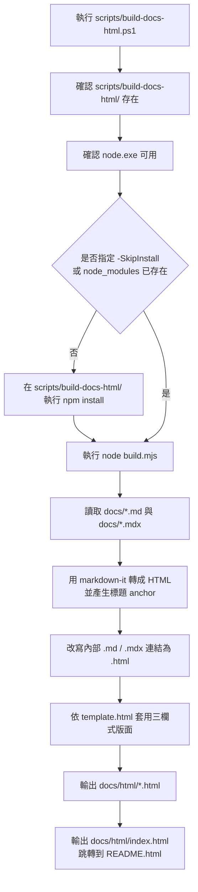

# `docs/*.md` / `docs/*.mdx` 轉 HTML 操作手冊

把 `docs/` 下所有 `.md` / `.mdx` 轉成 `docs/html/*.html`，方便用瀏覽器閱讀。輸出頁面採三欄式閱讀版面：左側是文件目錄，中間是正文內容，右側是目前文件的大綱連結，並支援 Mermaid 圖渲染與語法高亮。

## 1. Prerequisites

| 工具 | 版本 | 驗證指令 | 取得方式 |
|------|------|----------|----------|
| Node.js | 18+ | `node --version` | <https://nodejs.org/>（LTS） |
| PowerShell | 5.1+ | `$PSVersionTable.PSVersion` | Windows 10/11 內建 |

> 不需要全域 npm 套件，腳本第一次執行會在 `scripts/build-docs-html/` 內自動 `npm install`。

## 2. 三個常用指令

在 **repo 根目錄** 開 PowerShell 執行：

```powershell
# (1) 第一次執行（會自動 npm install，約 5 秒）
.\scripts\build-docs-html.ps1

# (2) 之後改了 docs/*.md 或 docs/*.mdx，重新產生（跳過 npm install，約 1 秒）
.\scripts\build-docs-html.ps1 -SkipInstall

# (3) 看完整參數說明
Get-Help .\scripts\build-docs-html.ps1 -Full
```

執行完成後：

```powershell
# 用預設瀏覽器開啟首頁（自動跳轉到 README.html）
start .\docs\html\index.html
```

## 3. 腳本執行流程

執行 `.\scripts\build-docs-html.ps1` 時，流程分成 PowerShell 入口檢查與 Node.js 轉換兩段：



各步驟的責任邊界：

| 步驟 | 負責檔案 | 做什麼 |
|------|----------|--------|
| PowerShell 入口 | `scripts/build-docs-html.ps1` | 檢查 Node.js、必要時安裝 npm 相依套件，然後呼叫 `build.mjs`。 |
| Markdown 轉換 | `scripts/build-docs-html/build.mjs` | 掃描 `docs/*.md` / `docs/*.mdx`，轉成 HTML，處理 Mermaid、標題 anchor、右側大綱與內部連結。 |
| HTML 版面 | `scripts/build-docs-html/template.html` | 定義三欄式頁面：左側文件目錄、中間正文、右側內容大綱。 |
| 輸出結果 | `docs/html/*.html` | 每份文件輸出一個同名 HTML，`index.html` 只負責導向 README 頁。 |

`-SkipInstall` 只會跳過 npm 相依套件安裝檢查，不會跳過 Markdown 轉 HTML；只要文件有修改，仍會重新輸出全部 `docs/html/*.html`。

## 4. Troubleshoot 速查

| 症狀 | 原因 | 處理 |
|------|------|------|
| `找不到 node.exe` | 沒裝 Node.js | 安裝 Node.js LTS 後重開 PowerShell 再試 |
| `npm install` 卡住或超時 | 公司 proxy / npm registry 被擋 | 改設 npm registry：`npm config set registry https://registry.npmmirror.com/` 後重跑 |
| HTML 開啟後 Mermaid 沒渲染、字型很醜 | 公司網路擋 jsdelivr CDN | 暫時無解，需換成本地資源（後續可改 `scripts/build-docs-html/template.html`） |
| 改了 `.md` / `.mdx` 但 HTML 沒變 | 沒重跑腳本 | 執行 `.\scripts\build-docs-html.ps1 -SkipInstall` |
| 右側內容大綱缺少項目 | 文件中沒有 `#` 到 `####` 標題 | 補上 Markdown 標題後重跑腳本 |
| 內部連結點下去 404 | 對應 `.md` / `.mdx` 沒被一起 build（如手動寫的 `./xxx.html` 連到不存在檔案） | 確認原文件連結是 `./xxx.md` 或 `./xxx.mdx`，腳本會自動改寫為 `.html` |

## 5. 工具檔案結構

```text
scripts/
├── build-docs-html.ps1            # PowerShell 入口（使用者只接觸這個）
└── build-docs-html/
    ├── package.json               # npm 套件定義（markdown-it、markdown-it-anchor）
    ├── package-lock.json          # 鎖版本，commit 進 repo
    ├── build.mjs                  # 實際的 Node 轉換邏輯（目錄、大綱、連結改寫）
    ├── template.html              # 三欄式 HTML 模板（改排版/CDN 來源就改這裡）
    └── node_modules/              # 自動安裝，.gitignore 已排除
```

要客製排版（顏色、字型、三欄寬度）→ 改 `template.html` 內的 `<style>`；要改文件篩選、右側大綱、連結改寫規則或 Mermaid 處理 → 改 `build.mjs`。
