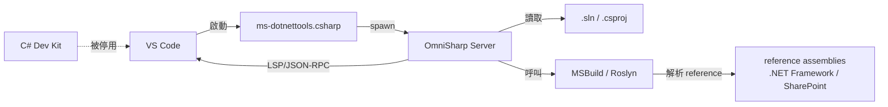

# OmniSharp Server 參考文件

## 0. 文件目的

本文件完整記錄 **OmniSharp Server** 在「VS Code 取代紫色 Visual Studio 開發 SharePoint Server / `.NET Framework` 專案」這個工作流中的角色、設定、啟動方式、驗證手段與常見排查。

> 本文件回答的問題：
> **OmniSharp 是什麼？為什麼要用它？怎麼確認它正常運作？壞掉時要從哪裡看？**

教學操作（公司電腦 PoC）請看 [`vscode-sharepoint-poc-runbook.md`](./vscode-sharepoint-poc-runbook.md)；驗收勾選請看 [`vscode-sharepoint-acceptance-checklist.md`](./vscode-sharepoint-acceptance-checklist.md)。

---

## 1. OmniSharp 是什麼

**OmniSharp** 是一個開源的 **C# 語言伺服器（Language Server）**，提供跨編輯器的 C# 智慧編輯能力（IntelliSense、跳轉、重構、診斷）。在 VS Code 中，它是 `ms-dotnettools.csharp` 擴充套件（俗稱 "C# extension"）的底層引擎。

| 項目 | 說明 |
|------|------|
| 專案首頁 | <https://www.omnisharp.net/> |
| 原始碼 | <https://github.com/OmniSharp/omnisharp-roslyn> |
| 授權 | MIT |
| 底層編譯器 | Roslyn |
| 啟動方式 | VS Code C# 擴充套件背景啟動 `OmniSharp.exe`（或 `OmniSharp.dll`）程序 |
| 通訊協定 | LSP（Language Server Protocol）/ stdio JSON-RPC |
| 設定來源 | `omnisharp.json`（專案級）+ VS Code `settings.json`（`omnisharp.*` 命名空間） |

### 1.1 OmniSharp 提供什麼能力

對應到 SharePoint / `.NET Framework` 日常開發：

| 能力 | VS Code 操作 | 對應驗收項目 |
|------|--------------|--------------|
| 載入 `.sln` / `.csproj` 與其參考組件 | 開啟 workspace | [`acceptance-checklist`](./vscode-sharepoint-acceptance-checklist.md) B1、B2 |
| IntelliSense 自動完成（成員、命名空間） | 輸入 `SPContext.` 跳出成員清單 | B3 |
| Go to Definition | F12 | B4 |
| Find All References | Shift+F12 | （日常） |
| Rename Symbol | F2 | B5 |
| 即時編譯錯誤（不需手動 build） | Problems 面板紅字 | B7 |
| Quick Fix / Code Action | `Ctrl+.` | （日常） |
| Roslyn Analyzers | 自動跑、輸出至 Problems 面板 | （日常） |

### 1.2 OmniSharp vs C# Dev Kit（重點）

VS Code 上有兩條 C# 路線：

| 比較項 | OmniSharp（本專案使用） | C# Dev Kit |
|--------|-------------------------|------------|
| 擴充套件名稱 | `ms-dotnettools.csharp`（單獨安裝，**不裝 Dev Kit**） | `ms-dotnettools.csdevkit` |
| 授權 | MIT（開源） | 微軟商業授權（需符合條件） |
| 主要支援 | `.NET Framework` + `.NET (Core)` 全系列、MSBuild 傳統格式 `.csproj` | 主要為 SDK-style `.csproj`（`.NET 6+`） |
| `.NET Framework 4.x` 完整支援 | ✅ 支援（走 legacy mode） | ❌ 不完整支援 |
| SharePoint Server Farm Solution | ✅ 可載入、可 IntelliSense | ⚠️ 載入 `.csproj` 但 IntelliSense 不穩 |
| Solution Explorer UI | ❌ 無（仰賴 VS Code 檔案總管） | ✅ 提供 |
| 本專案是否使用 | **使用** | **停用** |

**重點：** 本專案的目標是 SharePoint Server / `.NET Framework` 專案，因此必須走 **OmniSharp legacy mode**；C# Dev Kit 在本 workspace 必須停用或不安裝。

---

## 2. 安裝與啟用流程

OmniSharp **不需要單獨安裝**，它是 C# 擴充套件的內建引擎。完整觸發鏈：

```text
[1] 安裝 ms-dotnettools.csharp（C# extension）
        ↓
[2] 確保 C# Dev Kit 未安裝或在 workspace 停用
        ↓
[3] 開啟含 .cs / .csproj / .sln 的資料夾（VS Code workspace）
        ↓
[4] 擴充套件依 settings.json 啟動 OmniSharp Server 背景程序
        ↓
[5] Server 讀取 .sln/.csproj → 解析 reference → 建立 Roslyn workspace
        ↓
[6] VS Code 右下角狀態列出現「OmniSharp Server」🔥 圖示
        ↓
[7] IntelliSense / F12 / F2 / Problems 開始運作
```

### 2.1 安裝步驟

1. VS Code → Extensions（`Ctrl+Shift+X`）。
2. 搜尋 `C#`，安裝發佈者為 **Microsoft** 的 `C#`（`ms-dotnettools.csharp`）。
3. 若 Extensions 同時顯示 **C# Dev Kit**：
   - 若未安裝 → 不要安裝。
   - 若已安裝 → 按 `Disable (Workspace)`，**只在本 workspace 停用**，不影響其他專案。
4. 重新載入 VS Code（`Ctrl+Shift+P` → `Developer: Reload Window`）。

### 2.2 本專案使用的 `settings.json`

本 repo 的 `.vscode/settings.json` 已預先設定好 OmniSharp legacy mode：

```jsonc
{
  "dotnet.server.useOmnisharp": true,               // 強制走 OmniSharp，不走 Dev Kit 路徑
  "omnisharp.useModernNet": false,                  // 走 .NET Framework 相容模式（關鍵！）
  "omnisharp.enableMsBuildLoadProjectsOnDemand": false, // 啟動時立即載入所有專案，不延遲
  "omnisharp.enableRoslynAnalyzers": true           // 啟用 Roslyn analyzers
}
```

| 設定鍵 | 為什麼這樣設 |
|--------|--------------|
| `dotnet.server.useOmnisharp: true` | C# extension 預設可能切到 Dev Kit 路徑，本設定強制留在 OmniSharp。 |
| `omnisharp.useModernNet: false` | `true` 會跑在 .NET 6+ runtime 上、僅支援 SDK-style 專案；`.NET Framework 4.x` + 傳統 `.csproj` **必須設為 `false`**，否則載不到專案。 |
| `omnisharp.enableMsBuildLoadProjectsOnDemand: false` | 預設 `false` 已正確；若被改成 `true`，跨檔跳轉時容易出現「載入中」延遲。 |
| `omnisharp.enableRoslynAnalyzers: true` | 啟用後 Problems 面板會多顯示 analyzer 警告；對程式碼品質有幫助。 |

> 這些設定已 commit 到 repo，使用者只要 `git pull` 就會生效，**不需要手動設定**。

---

## 3. 啟動驗證

### 3.1 怎麼知道 OmniSharp 已啟動？

| 驗證方式 | 預期看到 |
|----------|----------|
| 右下角狀態列 | 🔥 圖示 + `OmniSharp Server`，滑鼠移上去顯示 `Running` |
| `View → Output` 切到 `OmniSharp Log` channel | 出現 `OmniSharp server started`、`Loaded project 'xxx.csproj'` |
| `Ctrl+Shift+P` → `OmniSharp: Show Output` | 同上，可直接開啟 OmniSharp Log |
| 工作管理員 / `Get-Process` | 出現 `OmniSharp` 或 `OmniSharp.exe` 程序 |
| 開 `.cs` 檔輸入 `System.` | 跳出成員清單，證明 IntelliSense 在運作 |

### 3.2 常用指令（Command Palette `Ctrl+Shift+P`）

| 指令 | 用途 |
|------|------|
| `OmniSharp: Restart OmniSharp` | 重啟伺服器（最常用，設定改完或載入失敗時） |
| `OmniSharp: Show Output` | 開啟 OmniSharp Log 輸出視窗 |
| `OmniSharp: Select Project` | 多 solution 時手動選要載入哪一個 |

---

## 4. OmniSharp Log 解讀

OmniSharp Log 是排查問題的主要入口。常見訊息：

| Log 訊息 | 意義 | 動作 |
|----------|------|------|
| `Starting OmniSharp server at ...` | 啟動中 | 等待 |
| `OmniSharp server started.` | 啟動成功 | — |
| `Loaded project 'xxx.csproj'` | 專案載入成功 | ✅ |
| `Could not locate MSBuild instance` | 找不到 MSBuild | 對照 [`runbook §2`](./vscode-sharepoint-poc-runbook.md) 安裝 Build Tools |
| `MSB4019: The imported project ... was not found` | targets 檔缺失（常為 SharePoint targets） | 對照 [`runbook §2`](./vscode-sharepoint-poc-runbook.md) |
| `Project does not target a recognized framework` | `useModernNet` 設定錯 | 檢查 `omnisharp.useModernNet: false` |
| `OmniSharp.MSBuild.ProjectManager: Failed to load project` | 專案載入失敗 | 看後續錯誤行 |
| `Detected Visual Studio version: 17.x` | 偵測到 Build Tools | ✅ |

---

## 5. 常見問題與排查

### 5.1 IntelliSense 完全沒反應（B3 失敗）

**排查順序：**

1. **右下角狀態列有沒有 🔥 OmniSharp Server？**
   - 沒有 → C# extension 未安裝或被 Dev Kit 搶走，回 §2.1。
2. **是不是 C# Dev Kit 接管？**
   - Extensions 搜尋 `C# Dev Kit`，若顯示已啟用 → `Disable (Workspace)`。
3. **`settings.json` 是否生效？**
   - `Ctrl+Shift+P` → `Preferences: Open Workspace Settings (JSON)`，確認 `useOmnisharp: true` 與 `useModernNet: false` 存在。
4. **OmniSharp Log 有沒有錯誤？**
   - `Ctrl+Shift+P` → `OmniSharp: Show Output`，找紅色 `error` 行。
5. **重啟 OmniSharp。**
   - `Ctrl+Shift+P` → `OmniSharp: Restart OmniSharp`。
6. **重啟 VS Code。**
   - `Developer: Reload Window`。

### 5.2 IntelliSense 部分檔案有、部分沒有

通常是 **某個 `.csproj` 載入失敗**。

- 開 OmniSharp Log，搜尋 `Failed to load project`，看是哪一個專案、什麼原因。
- 常見原因：缺 SharePoint targets、缺 reference assembly、`.csproj` 語法錯誤。

### 5.3 跨檔跳轉 F12 跳不到

- 確認 `omnisharp.enableMsBuildLoadProjectsOnDemand: false`（本 repo 預設）。
- 若是跳到外部組件（`SPContext` 等），第一次跳轉會解 metadata，需要幾秒。

### 5.4 OmniSharp 一直在 `Loading...`

- 大型 solution 第一次載入可能需要 1～3 分鐘，請等待。
- 超過 5 分鐘仍未完成：開 OmniSharp Log 看卡在哪個專案。
- 終極手段：刪除 `.vs/`、`bin/`、`obj/` 後重啟 OmniSharp。

### 5.5 改了 `settings.json` 沒效果

- OmniSharp 設定變更後，**必須重啟 OmniSharp** 才會生效：`OmniSharp: Restart OmniSharp`。

---

## 6. 與其他元件的關係



| 元件 | 角色 |
|------|------|
| VS Code | 編輯器 UI |
| C# extension | OmniSharp 的 host，負責啟動與通訊 |
| OmniSharp Server | C# 語言伺服器，提供 IntelliSense / 跳轉 / 重構 |
| MSBuild | OmniSharp 用來解析 `.csproj` 結構與相依 |
| Roslyn | OmniSharp 內建編譯器，產生語法樹與診斷 |
| reference assemblies | `.NET Framework` 4.x SDK + SharePoint DLLs |
| C# Dev Kit | **本專案不使用** |

> 注意：OmniSharp 只負責「編輯期智慧能力」，不負責 build / package / deploy。後者由 `scripts/*.ps1` 透過 MSBuild 與 SharePoint PowerShell 完成，兩條鏈完全獨立。

---

## 7. 不在 OmniSharp 範圍內

以下能力 OmniSharp **不提供**，本專案也不打算用 OmniSharp 解決：

| 能力 | 替代方式 |
|------|----------|
| 編譯產生 `.dll` / `.wsp` | `scripts/build.ps1` + `scripts/package.ps1`（MSBuild） |
| Validate Package | `scripts/validate-package.ps1` |
| 部署到 SharePoint Server | `scripts/deploy-wsp.ps1`（SharePoint PowerShell） |
| Update / Retract | `scripts/update-wsp.ps1`、`scripts/retract-wsp.ps1` |
| Package Designer / Feature Designer UI | 直接編輯 XML |
| WinForms / WPF Designer | 不在本專案範圍 |
| Debug attach to `w3wp.exe`（SharePoint process） | 需另外用 VS Code C# debugger + 額外設定，目前未驗證 |

---

## 8. 與本專案文件的對應

| 文件 | 與本文件的關係 |
|------|----------------|
| [`framework.md`](./framework.md) | 原始需求 |
| [`vscode-sharepoint-dotnet-framework-feasibility.md`](./vscode-sharepoint-dotnet-framework-feasibility.md) | §「建議 VS Code workspace 設定」決定使用 OmniSharp legacy mode |
| [`vscode-sharepoint-workflow-dependency-order.md`](./vscode-sharepoint-workflow-dependency-order.md) | 任務 2 產出 `.vscode/settings.json` 含 OmniSharp 設定 |
| [`vscode-sharepoint-poc-runbook.md`](./vscode-sharepoint-poc-runbook.md) | §1 列出 C# extension 為必要工具 |
| [`vscode-sharepoint-acceptance-checklist.md`](./vscode-sharepoint-acceptance-checklist.md) | Stage 1 A2/A3、Stage 2 B1～B5/B7 驗證 OmniSharp 行為 |
| **本文件** | OmniSharp 完整參考；前述文件提到 OmniSharp 時皆可回查本文件 |

---

## 9. 參考連結

- OmniSharp 官網：<https://www.omnisharp.net/>
- OmniSharp on GitHub：<https://github.com/OmniSharp/omnisharp-roslyn>
- VS Code C# extension：<https://marketplace.visualstudio.com/items?itemName=ms-dotnettools.csharp>
- C# Dev Kit FAQ（含與 OmniSharp 共存說明）：<https://code.visualstudio.com/docs/csharp/cs-dev-kit-faq>
- OmniSharp 設定參考：<https://github.com/OmniSharp/omnisharp-vscode/blob/master/package.json>（搜尋 `omnisharp.*` 設定鍵）
