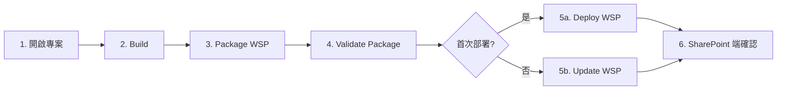

# VS Code SharePoint 公司電腦 PoC 操作手冊

## 目的

本手冊讓公司電腦或可連到 SharePoint Server 的環境，能照順序完成前置檢查、修改參數、執行第一次 build / package / deploy / update / retract 流程，驗證 VS Code 工作流是否成立。

本機（無 SharePoint 環境）不執行 SharePoint 實測；本手冊全部步驟皆設計為在 **公司電腦 / SharePoint Server 環境** 執行。

依賴前提請參考 [`vscode-sharepoint-workflow-dependency-order.md`](./vscode-sharepoint-workflow-dependency-order.md) 中的步驟 6、步驟 7、步驟 8。

## 1. 必要工具清單

公司電腦上應確認以下工具均已安裝且可用：

| 項目 | 用途 | 確認方式 |
|------|------|----------|
| Visual Studio Code | 主要編輯器 | `code --version` |
| C# extension（`ms-dotnettools.csharp`） | OmniSharp legacy IntelliSense | VS Code Extensions 介面確認 |
| .NET Framework Developer Pack | 編譯所需 reference assemblies | 控制台「程式和功能」確認版本 |
| Visual Studio Build Tools 或 Visual Studio 任一版本 | 提供 `MSBuild.exe` 與 SharePoint targets | 見 §2 |
| SharePoint Server 安裝（含 PowerShell snap-in） | 提供 `Add-SPSolution` 等 cmdlet | 見 §3 |
| Windows PowerShell 5.1（不是 PowerShell 7） | 載入 SharePoint snap-in | `powershell.exe -Version` |

C# Dev Kit **不要安裝**或在本 workspace 停用；它不支援 .NET Framework 專案，會與 OmniSharp legacy 衝突。`settings.json` 已預設 `omnisharp.useModernNet: false`，但 Dev Kit 仍可能接管。

## 2. 確認 `MSBuild.exe`

SharePoint 專案需要 Visual Studio 安裝下的 SharePoint targets，僅安裝 .NET SDK 是不夠的。

### 2.1 尋找 MSBuild.exe

開啟 Windows PowerShell（**非 PowerShell 7**）並執行：

```powershell
# 方法 1：Visual Studio 2017+ 推薦使用 vswhere
& "${env:ProgramFiles(x86)}\Microsoft Visual Studio\Installer\vswhere.exe" -latest -requires Microsoft.Component.MSBuild -find "MSBuild\**\Bin\MSBuild.exe"

# 方法 2：直接搜尋常見路徑
Get-ChildItem "C:\Program Files (x86)\Microsoft Visual Studio\*\*\MSBuild\*\Bin\MSBuild.exe" -ErrorAction SilentlyContinue
Get-ChildItem "C:\Program Files\Microsoft Visual Studio\*\*\MSBuild\*\Bin\MSBuild.exe" -ErrorAction SilentlyContinue
```

### 2.2 把 MSBuild 帶入 PATH（任一方式）

方式 A：使用「Developer PowerShell for VS」終端機（最簡單，PATH 已配置）。

方式 B：把找到的 MSBuild 路徑加入使用者 `PATH`：

```powershell
$msbuildDir = Split-Path (& "${env:ProgramFiles(x86)}\Microsoft Visual Studio\Installer\vswhere.exe" -latest -requires Microsoft.Component.MSBuild -find "MSBuild\**\Bin\MSBuild.exe")
[Environment]::SetEnvironmentVariable("Path", "$([Environment]::GetEnvironmentVariable('Path','User'));$msbuildDir", "User")
# 重開 terminal 後生效
```

方式 C：呼叫腳本時用 `-MsBuildPath` 參數帶入完整路徑（不必改 PATH）。

### 2.3 驗證 SharePoint targets

```powershell
# 應該找到 Microsoft.VisualStudio.SharePoint.targets 之類檔案
Get-ChildItem "C:\Program Files (x86)\MSBuild\Microsoft\VisualStudio\*\SharePointTools\" -ErrorAction SilentlyContinue
Get-ChildItem "C:\Program Files (x86)\Microsoft Visual Studio\*\*\MSBuild\Microsoft\VisualStudio\*\SharePointTools\" -ErrorAction SilentlyContinue
```

找不到時通常代表 Visual Studio 安裝沒有勾選「Office/SharePoint 開發」工作負載，需在 Visual Studio Installer 補裝。

## 3. 安裝或啟用 SharePoint PowerShell

本步驟對應 [`vscode-sharepoint-workflow-dependency-order.md`](./vscode-sharepoint-workflow-dependency-order.md) 步驟 7。

### 3.1 確認指令是否可用

開啟 **Windows PowerShell（以系統管理員執行）**，執行：

```powershell
Get-Command -Name Add-SPSolution -ErrorAction SilentlyContinue
```

若有回傳結果，跳到 §3.4 確認權限；無回傳則繼續。

### 3.2 載入 snap-in（SharePoint 2010 / 2013 / 2016 / 2019）

```powershell
Get-PSSnapin -Registered -Name "Microsoft.SharePoint.PowerShell"
Add-PSSnapin -Name "Microsoft.SharePoint.PowerShell"
```

如要自動載入，可在 PowerShell `$PROFILE` 加入 `Add-PSSnapin -Name "Microsoft.SharePoint.PowerShell"`，或直接使用「SharePoint 2016 Management Shell」捷徑（已預載 snap-in）。

### 3.3 SharePoint Subscription Edition / SharePoint Server 2019+ Module

部分版本改為 Module：

```powershell
Get-Module -ListAvailable -Name "Microsoft.SharePoint.Powershell"
Import-Module -Name "Microsoft.SharePoint.Powershell"
```

### 3.4 確認帳號權限

執行帳號需滿足下列其一：

- Farm Administrator
- Shell Admin（透過 `Add-SPShellAdmin` 授權）
- 對 Web Application 有部署 solution 權限

```powershell
# 確認 Shell Admin
Get-SPShellAdmin
# 若沒有當前帳號，請以 Farm Admin 執行：
# Add-SPShellAdmin -UserName "DOMAIN\you"
```

### 3.5 確認 Execution Policy

腳本以 `-ExecutionPolicy Bypass` 啟動，所以即使 LocalMachine 為 `Restricted` 仍可執行。但若公司有 AppLocker 或 Constrained Language Mode 限制，需先解除：

```powershell
Get-ExecutionPolicy -List
$ExecutionContext.SessionState.LanguageMode  # 應為 FullLanguage
```

`ConstrainedLanguage` 會讓 `Set-StrictMode` 與部分腳本語法失效，需聯絡 IT 解除或改用允許清單帳號。

## 4. 修改腳本參數

`scripts/*.ps1` 全部採參數化設計，不需要編輯腳本本體。三種改參數方式：

### 4.1 在 VS Code Task 中改 input 預設值

開啟 `.vscode/tasks.json` 的 `inputs` 區段，把 `default` 換成公司專案路徑：

```jsonc
{
  "id": "solutionPath",
  "type": "promptString",
  "description": "輸入 .sln 路徑",
  "default": "${workspaceFolder}/src/Contoso.SharePoint.sln"  // 換成公司 sln
},
{
  "id": "webApplicationUrl",
  "type": "promptString",
  "description": "輸入 SharePoint Web Application URL",
  "default": "http://intranet.contoso.local"  // 換成公司 SharePoint URL
}
```

注意：**請勿把公司專屬路徑或 URL 提交到 git**，可考慮把 `tasks.json` 加進 `.gitignore` 或維護成個人本地檔案（VS Code 也支援 `tasks.json` 與 `*.code-workspace` 共存）。

### 4.2 從 VS Code Command Palette 執行

`Terminal → Run Task`，每個 task 會彈出輸入框，臨時帶入該次參數，不會修改檔案。

### 4.3 直接從 terminal 呼叫腳本

最靈活，可帶任意進階參數（如 `-DeployToGac`、`-Force`、`-CompatibilityLevel`）：

```powershell
.\scripts\build.ps1 -SolutionPath ".\src\Contoso.SharePoint.sln" -Configuration Release
.\scripts\package.ps1 -ProjectPath ".\src\Contoso.Portal\Contoso.Portal.csproj" -Configuration Release
.\scripts\deploy-wsp.ps1 -WspPath ".\src\Contoso.Portal\bin\Release\Contoso.Portal.wsp" -WebApplicationUrl "http://intranet.contoso.local" -DeployToGac -Force
```

## 5. 第一次 PoC 執行順序

請以「公司專案 + 公司 SharePoint Server」為對象，照順序執行：



### 步驟對應 task

| 步驟 | VS Code Task | 等同命令 |
|------|--------------|----------|
| 1. 開啟專案 | `code .` 開啟 workspace | — |
| 2. Build | `SharePoint: Build` | `.\scripts\build.ps1 -SolutionPath ...` |
| 3. Package | `SharePoint: Package WSP` | `.\scripts\package.ps1 -ProjectPath ...` |
| 4. Validate | `SharePoint: Validate Package` | `.\scripts\validate-package.ps1 -ProjectPath ...` |
| 5a. Deploy | `SharePoint: Deploy WSP` 或 `... (All Web Apps)` | `.\scripts\deploy-wsp.ps1 -WspPath ... -WebApplicationUrl ...` |
| 5b. Update | `SharePoint: Update WSP` | `.\scripts\update-wsp.ps1 -WspPath ...` |
| 6. 確認 | 到 SharePoint Central Administration 檢查 | — |

### SharePoint 端確認項目

- 「Central Administration → System Settings → Manage farm solutions」確認 solution 狀態為 `Deployed`。
- 「Site Settings → Site collection features / Site features」確認 Feature 是否啟用。
- 對應 Web Application 的 IIS 應用程式集區是否仍 Running。
- `LOGS\` 資料夾與 ULS Viewer 確認沒有部署期間錯誤。

## 6. 常見失敗點與排查方向

| 症狀 | 可能原因 | 排查 / 修正 |
|------|----------|-------------|
| `找不到 MSBuild.exe` | 未安裝 Visual Studio Build Tools 或不在 PATH | 用 §2.1 vswhere 找出路徑，或以 `-MsBuildPath` 傳入完整路徑 |
| `error MSB4019: 找不到 ...SharePointTools.targets` | Visual Studio 未安裝 Office/SharePoint 工作負載 | 在 Visual Studio Installer 補裝 |
| `error CS0246: 找不到型別 Microsoft.SharePoint...` | 缺 SharePoint reference assemblies（通常隨 SharePoint Server 安裝） | 確認專案 reference 用 `HintPath` 或 `<Reference>` 指向 SharePoint ISAPI 目錄 |
| `找不到 SharePoint PowerShell` | snap-in 未載入或 PowerShell 7 環境 | 切回 Windows PowerShell 5.1，依 §3.2 載入 snap-in |
| `Add-SPSolution: 拒絕存取` | 帳號非 Farm Admin / Shell Admin | 用 Farm Admin 執行 `Add-SPShellAdmin`，或改用具權限的帳號 |
| Deploy 後 SharePoint 站台無變化 | Timer Job 尚未處理 / 部署到錯誤 Web Application | 用 `Get-SPSolution` 看 `Status`；用 `Get-SPTimerJob` 看 `job-solution-deployment`；確認 `-WebApplicationUrl` 對應正確 |
| `Update-SPSolution` 沒生效 | Feature schema 有 breaking change，須先 retract 再 deploy | 用 Retract + Deploy 取代 Update；或加 `-Force` |
| `Install-SPSolution: ...IIS reset 失敗` | 高權限 / 服務啟動順序問題 | 手動 `iisreset /noforce`，再重跑 deploy |
| Update 後 GAC 中仍是舊 dll | Update 沒進 GAC | 帶 `-DeployToGac`；或 retract → deploy |
| `New-Item -Force` 之類腳本語法錯誤 | PowerShell 在 ConstrainedLanguage Mode | 見 §3.5 |

## 7. 完成標準

PoC 視為通過，需同時滿足：

- [ ] 不開紫色 Visual Studio 可以完成 `SharePoint: Build`。
- [ ] 不開紫色 Visual Studio 可以產生 `.wsp`（`SharePoint: Package WSP` 成功）。
- [ ] `SharePoint: Validate Package` 無 error。
- [ ] `SharePoint: Deploy WSP` 或 `Update WSP` 成功，且 solution 在 SharePoint Central Administration 顯示 `Deployed`。
- [ ] `SharePoint: Retract WSP` 可以乾淨解除安裝，後續再 deploy 不殘留。
- [ ] 文件中常見失敗點皆能用本手冊指引處理。

完成後請把實測結果與調整紀錄回填至 [`vscode-sharepoint-workflow-dependency-order.md`](./vscode-sharepoint-workflow-dependency-order.md) 的步驟 9「修正與模板化」段落。

## 8. 本機限制與不執行項目

下列項目 **不在本手冊範圍**，本機環境也不執行：

1. 本機沒有 SharePoint Server，不執行任何 `Add-SPSolution` / `Install-SPSolution` 之類指令。
2. 本機 PowerShell 不嘗試載入 SharePoint snap-in；腳本碰到 snap-in 缺失時應拋出明確錯誤，視為預期行為。
3. 本機不安裝 SharePoint reference assemblies；公司專案在本機 build 通常會失敗，這是預期的，須等公司電腦驗證。
4. VS Code extension 開發暫不執行（依[依賴文件](./vscode-sharepoint-workflow-dependency-order.md)步驟 10，等 scripts 與 tasks 穩定後再評估）。
