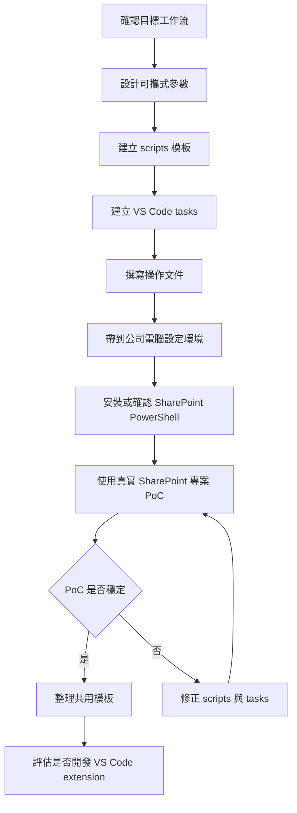

# VS Code SharePoint 工作流依賴步驟順序

## 目的

本文件記錄從「可行性評估」推進到「公司 SharePoint 環境實測」之前的依賴順序。

目前限制是本機沒有 Windows Server / SharePoint Server 環境，因此不在本機驗證 SharePoint 是否可建置、打包或部署。現階段只先產出可攜式工作流模板與操作規格，等到公司電腦或公司伺服器環境再進行 PoC 驗證。

## 決策前提

1. 主要目標是保留 VS Code 輕量工作流。
2. 目標專案是 SharePoint Server / `.NET Framework` 專案。
3. 需要支援 build、package `.wsp`、deploy、update、retract。
4. 不需要 WinForms、WPF、Razor 或其他視覺化 Designer。
5. 本機不驗證 SharePoint runtime，SharePoint 相關驗證移到公司電腦執行。
6. 優先建立命令列與 VS Code tasks 流程，不優先開發 VS Code extension。
7. 不預設公司電腦已具備 SharePoint PowerShell；安裝或確認 SharePoint PowerShell 可用是公司端前置步驟。

## 依賴順序總覽



## 步驟 1：確認目標工作流

執行位置：本機。

目的：先定義 VS Code 要承接哪些操作，避免把範圍擴大成完整 Visual Studio 替代品。

輸出：

1. VS Code 負責編輯。
2. MSBuild 負責 build。
3. MSBuild target 負責 package `.wsp`。
4. PowerShell / SharePoint Management Shell 負責 deploy、update、retract。
5. VS Code tasks 負責把常用命令整合成可執行任務。

此步驟完成後，才能進入參數設計。

## 步驟 2：設計可攜式參數

執行位置：本機。

目的：避免腳本硬編碼公司電腦路徑、伺服器 URL 或專案名稱。

建議參數：

1. `SolutionPath`
2. `ProjectPath`
3. `Configuration`
4. `Platform`
5. `MsBuildPath`
6. `PackageOutputPath`
7. `WspPath`
8. `SolutionName`
9. `WebApplicationUrl`
10. `DeployToGac`
11. `Force`

此步驟完成後，才能開始建立 scripts 模板。

## 步驟 3：建立 scripts 模板

執行位置：本機。

目的：先把 SharePoint 工作流拆成可重複執行的 PowerShell 腳本。這些腳本在本機只做語法與參數設計，不驗證 SharePoint 實際行為。

建議檔案：

```text
scripts/
  build.ps1
  package.ps1
  validate-package.ps1
  deploy-wsp.ps1
  update-wsp.ps1
  retract-wsp.ps1
```

腳本職責：

1. `build.ps1`：呼叫 MSBuild 執行專案或 solution build。
2. `package.ps1`：呼叫 MSBuild `/t:Package` 產生 `.wsp`。
3. `validate-package.ps1`：呼叫 MSBuild `/t:ValidatePackage` 驗證 package。
4. `deploy-wsp.ps1`：呼叫 SharePoint PowerShell 新增與安裝 solution。
5. `update-wsp.ps1`：呼叫 SharePoint PowerShell 更新既有 solution。
6. `retract-wsp.ps1`：呼叫 SharePoint PowerShell 解除安裝與移除 solution。

此步驟完成後，才能建立 VS Code tasks。

## 步驟 4：建立 VS Code tasks

執行位置：本機。

目的：讓 VS Code 可透過 command palette 或 task runner 執行 scripts。

建議檔案：

```text
.vscode/
  settings.json
  tasks.json
```

建議 tasks：

1. `SharePoint: Build`
2. `SharePoint: Package WSP`
3. `SharePoint: Validate Package`
4. `SharePoint: Deploy WSP`
5. `SharePoint: Update WSP`
6. `SharePoint: Retract WSP`

此步驟依賴 scripts 模板，因為 tasks 只負責呼叫腳本，不直接承擔部署邏輯。

## 步驟 5：撰寫操作文件

執行位置：本機。

目的：讓公司電腦驗證時可以照文件準備環境與執行 PoC。

操作文件需包含：

1. 必要工具清單。
2. VS Code extension 建議。
3. `.NET Framework Developer Pack` 版本對應方式。
4. `MSBuild.exe` 尋找方式。
5. SharePoint PowerShell / SharePoint Management Shell 安裝或啟用步驟。
6. 部署帳號權限前提。
7. 第一次 PoC 的執行順序。
8. 常見失敗點與排查方向。

此步驟完成後，才適合切到公司電腦進行驗證。

## 步驟 6：公司電腦基礎環境設定

執行位置：公司電腦或可連到 SharePoint Server 的環境。

目的：確認公司電腦具備實際建置與打包 SharePoint solution 的條件。SharePoint PowerShell 不在此步驟假設已存在，需於下一步明確安裝或確認。

需確認：

1. `MSBuild.exe` 可用。
2. 目標 `.NET Framework Developer Pack` 已安裝。
3. SharePoint project targets / assemblies 可被找到。
4. 真實專案可在不開 Visual Studio 的情況下被命令列建置。

此步驟完成後，才能進入 SharePoint PowerShell 前置設定。

## 步驟 7：安裝或確認 SharePoint PowerShell

執行位置：公司電腦或可連到 SharePoint Server 的環境。

目的：把 SharePoint solution 部署能力當成明確前置依賴，而不是隱含假設。

需確認：

1. SharePoint PowerShell / SharePoint Management Shell 已安裝或可啟用。
2. PowerShell 可以載入 SharePoint 管理指令所需 module、snap-in 或管理工具。
3. 可執行 solution 部署相關 cmdlet，例如 `Add-SPSolution`、`Install-SPSolution`、`Update-SPSolution`、`Uninstall-SPSolution`、`Remove-SPSolution`。
4. 執行者具有部署 solution 的權限。
5. PowerShell execution policy 不會阻擋專案 scripts 執行。

此步驟完成後，才能進入真實專案 PoC。

## 步驟 8：真實 SharePoint 專案 PoC

執行位置：公司電腦或可連到 SharePoint Server 的環境。

目的：用公司真實專案驗證 VS Code 工作流是否成立。

建議順序：

1. 在 VS Code 開啟專案。
2. 執行 `SharePoint: Build`。
3. 執行 `SharePoint: Package WSP`。
4. 執行 `SharePoint: Validate Package`。
5. 執行 `SharePoint: Deploy WSP` 或 `SharePoint: Update WSP`。
6. 到 SharePoint Server 確認 solution 與 feature 狀態。

成功標準：

1. 不開紫色 Visual Studio 也能完成 build。
2. 不開紫色 Visual Studio 也能產生 `.wsp`。
3. 不開紫色 Visual Studio 也能部署或更新 solution。
4. 部署結果可在 SharePoint Server 上被確認。

## 步驟 9：修正與模板化

執行位置：本機與公司電腦都可能需要。

目的：根據 PoC 結果修正 scripts、tasks 與文件。

常見調整：

1. 補上公司專案特有的 MSBuild property。
2. 補上 SharePoint solution 更新前後的等待與狀態檢查。
3. 補上 IIS reset 或服務重啟策略。
4. 補上 Feature activation / deactivation 步驟。
5. 補上錯誤訊息與 exit code 處理。

此步驟需反覆執行，直到流程穩定。

## 步驟 10：評估 VS Code extension

執行位置：本機。

前提：只有在 scripts 與 tasks 已穩定後才評估 extension。

extension 可做的事：

1. 提供 Command Palette 指令。
2. 提供側邊欄按鈕。
3. 顯示目前 project / solution / WSP 設定。
4. 呼叫既有 PowerShell scripts。
5. 顯示 build / package / deploy 結果。

extension 不應做的事：

1. 不直接重寫 SharePoint 部署邏輯。
2. 不重做 Visual Studio Designer。
3. 不把公司環境路徑硬編碼在 extension 內。

## 目前下一步

目前應先執行：

1. ~~建立 scripts 模板。~~（已完成）
2. ~~建立 VS Code tasks 模板。~~（已完成）
3. ~~撰寫公司電腦 PoC 操作文件。~~（已完成，見 `docs/vscode-sharepoint-poc-runbook.md`）
4. ~~在操作文件中加入 SharePoint PowerShell / SharePoint Management Shell 安裝或啟用前置步驟。~~（已併入 PoC 手冊 §3）

剩餘任務 4 為 `[blocked]`，需到公司電腦或可連到 SharePoint Server 的環境執行實測，本機無法繼續推進。

## 明確執行清單

狀態定義：

- `[x]` 已完成，可供後續工具直接使用。
- `[ ]` 尚未完成，是下一個可執行工作。
- `[blocked]` 需等待公司電腦或 SharePoint Server 環境。

### 交接任務表

| 順序 | 狀態 | 任務 | 輸出 | 接手說明 |
| --- | --- | --- | --- | --- |
| 1 | `[x]` | 建立 `scripts/` 模板 | `scripts/*.ps1` | 已完成六個 PowerShell 腳本模板，後續可直接被 `.vscode/tasks.json` 呼叫。 |
| 2 | `[x]` | 建立 `.vscode/tasks.json` | `.vscode/tasks.json`、`.vscode/settings.json` | 已建立十個 VS Code tasks（六個規格 task 加上 `Build (Project)`、`Deploy WSP (All Web Apps)`、`Retract WSP (All Web Apps)`、`Retract WSP (All Web Apps + Remove from Farm)` 等變體）與 OmniSharp legacy 設定，全部透過 `${input:*}` 提示輸入，不硬編碼公司路徑。 |
| 3 | `[x]` | 補公司電腦 PoC 操作文件 | `docs/vscode-sharepoint-poc-runbook.md` | 已撰寫 8 章節 PoC 手冊：必要工具、MSBuild 尋找、SharePoint PowerShell 載入、修改參數三種方式、第一次 PoC 執行順序、常見失敗點對照表、完成標準、本機限制。 |
| 4 | `[blocked]` | 到公司電腦或 SharePoint Server 環境實測 | PoC 結果與修正紀錄 | 本機不執行 SharePoint 實測，需等公司環境具備 SharePoint PowerShell、MSBuild 與真實專案。 |

### 1. `[x]` 先建立 `scripts/` 模板

完成檔案：

- [x] `scripts/build.ps1`
- [x] `scripts/package.ps1`
- [x] `scripts/validate-package.ps1`
- [x] `scripts/deploy-wsp.ps1`
- [x] `scripts/update-wsp.ps1`
- [x] `scripts/retract-wsp.ps1`

完成標準：

- [x] 六個腳本檔案已建立。
- [x] 腳本採參數化設計，不硬編碼公司電腦路徑。
- [x] build / package / validate 由 MSBuild 負責。
- [x] deploy / update / retract 由 SharePoint PowerShell 負責。
- [x] SharePoint PowerShell 不存在時會回報明確錯誤。
- [x] 已用 PowerShell parser 做語法檢查。

後續依賴：

- `.vscode/tasks.json` 應直接呼叫這六個腳本，不應重新實作 build 或部署邏輯。

### 2. `[x]` 已建立 `.vscode/tasks.json`

完成檔案：

- [x] `.vscode/tasks.json`
- [x] `.vscode/settings.json`（啟用 OmniSharp legacy、固定 PowerShell 為預設 terminal）

已建立 tasks：

規格要求的六個 task：

- [x] `SharePoint: Build`（以 `-SolutionPath` 建置 solution，預設 build group）
- [x] `SharePoint: Package WSP`
- [x] `SharePoint: Validate Package`
- [x] `SharePoint: Deploy WSP`（指定 `-WebApplicationUrl`）
- [x] `SharePoint: Update WSP`
- [x] `SharePoint: Retract WSP`（指定 `-WebApplicationUrl`）

延伸 variant（為了暴露腳本中的互斥分支與常見變化，避免使用者手動改 task）：

- [x] `SharePoint: Build (Project)`：當沒有 `.sln` 或只想建單一專案時使用 `-ProjectPath`。
- [x] `SharePoint: Deploy WSP (All Web Apps)`：傳遞 `-AllWebApplications`，與 `-WebApplicationUrl` 互斥。
- [x] `SharePoint: Retract WSP (All Web Apps)`：對所有 Web Application 解除安裝。
- [x] `SharePoint: Retract WSP (All Web Apps + Remove from Farm)`：Uninstall + Remove 一次完成。

完成標準：

- [x] 每個 task 都呼叫對應的 `scripts/*.ps1`。
- [x] task 參數透過 `inputs` 提示輸入，使用 `${workspaceFolder}` 與 `${input:*}`，不硬編碼公司路徑。
- [x] build / package / validate task 可在本機檢查參數結構，但不要求本機具備 SharePoint。
- [x] deploy / update / retract task 在 `detail` 中明確標示 `[需公司電腦/SharePoint Server 環境]`。
- [x] JSON 語法已用 PowerShell `ConvertFrom-Json` 驗證通過。

### 3. `[x]` 已補公司電腦 PoC 操作文件

完成檔案：

- [x] `docs/vscode-sharepoint-poc-runbook.md`

已記錄內容：

- [x] §1 必要工具清單（VS Code、C# extension、.NET Framework Developer Pack、MSBuild、SharePoint Server、Windows PowerShell 5.1）。
- [x] §2 確認 `MSBuild.exe`（vswhere 尋找、PATH 設定三種方式、SharePoint targets 驗證）。
- [x] §3 安裝或啟用 SharePoint PowerShell / SharePoint Management Shell（snap-in、Module、權限、Execution Policy）。
- [x] §4 修改腳本參數（task default、Command Palette 輸入、terminal 直呼三種方式）。
- [x] §5 第一次 PoC 執行順序與 SharePoint 端確認項目。
- [x] §6 常見失敗點與排查方向（MSBuild、reference assemblies、PowerShell、Deploy/Update/Retract 各類錯誤對照表）。

完成標準：

- [x] 文件可讓公司電腦使用者按順序完成前置檢查。
- [x] 文件列出第一次 PoC 的建議命令（task 名稱與等同 PowerShell 指令並列）。
- [x] 文件列出常見失敗點與排查方向（§6 對照表）。
- [x] 文件明確說明本機不做 SharePoint 實測（§8 本機限制與不執行項目）。

### 4. `[blocked]` 等到公司電腦或 SharePoint Server 環境再實測

等待原因：

- 本機沒有 Windows Server / SharePoint Server 環境。
- 本機不應假設 SharePoint PowerShell 已存在。
- 真實 build / package / deploy 需要公司專案與公司 SharePoint 環境。

成功標準：

- [ ] 不開紫色 Visual Studio 能 build。
- [ ] 能產生 `.wsp`。
- [ ] 能透過 PowerShell deploy / update / retract。
- [ ] 部署結果可在 SharePoint Server 上被確認。

暫不執行：

1. 本機 SharePoint 環境檢查。
2. 本機 SharePoint build/package/deploy 驗證。
3. VS Code extension 開發。
